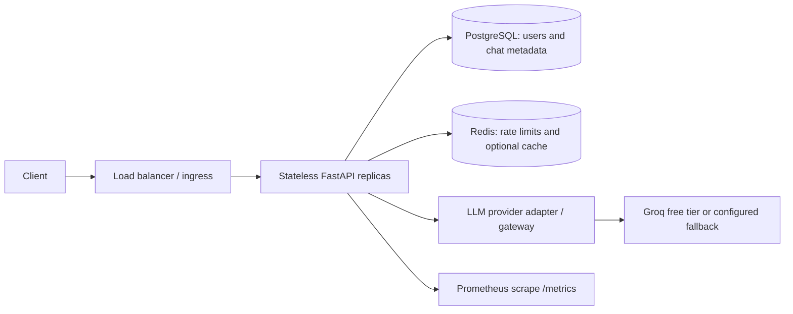

# AI-QA Platform

An authenticated FastAPI question-answering service with a replaceable LLM adapter, async PostgreSQL persistence, Redis-backed controls, and Prometheus metrics. It is designed as a compact assessment submission: operational behavior is explicit, and development credentials are never production credentials.

## Features

- `POST /auth/login` issues short-lived JWTs; `GET /me` returns the authenticated identity.
- `POST /chat` checks role and distributed per-user rate limits, optionally reuses a shared public-question cache, calls the provider, and records usage/latency/status in PostgreSQL.
- `GET /health`, `/health/live`, and `/health/ready` provide basic and dependency-aware health checks.
- `GET /metrics` exposes Prometheus metrics to ADMIN users.
- SQLAlchemy 2 async sessions, Alembic migration, containerized local dependencies, correlation IDs, and mocked provider tests.
- Streamlit workspace with login, responsive chat, starter prompts, service status, and per-answer usage/latency details.

## Architecture



The API layer handles auth, validation, and request IDs. `ChatService` owns rate limit/cache/persistence orchestration; `LLMProvider` isolates provider-specific API calls and usage parsing. See [docs/architecture.md](docs/architecture.md) for the scaling and migration design.

## Technology choices

- **FastAPI:** async request handling, typed validation, generated OpenAPI, dependency injection.
- **PostgreSQL:** durable users and audit-friendly chat metadata with relational integrity and indexes.
- **Redis:** shared rate-limit counters and bounded-TTL cache across API replicas.
- **JWT:** stateless local API auth. Production should delegate identity to OIDC and validate issuer/audience/signature.
- **Docker Compose:** repeatable local API, database, and Redis startup; production orchestration is intentionally a separate deployment decision.

## Authentication and RBAC

Login accepts JSON (`username` is an email). Passwords use Argon2 via `pwdlib`. JWT claims include `sub`, `role`, `iat`, and `exp`, signed with `JWT_SECRET_KEY`. `ADMIN` can access metrics and chat; `USER` can chat; `READ_ONLY` can use identity and health read endpoints but cannot chat or view restricted metrics. Authorization is centralized in `get_current_user()` and `require_role()`.

For production SSO, use Authorization Code + PKCE at an OIDC identity provider. The API or API gateway validates issuer, audience, signature/JWKS rotation, expiry, and mapped roles. Do not issue passwords or long-lived signing secrets from application code.

## LLM integration, retry, and fallback

The business service targets the `LLMProvider` protocol. The default `GroqProvider` calls Groq's OpenAI-compatible API using the OpenAI Python transport; it does not use an OpenAI key or paid OpenAI API. Groq documents a free plan with model-specific limits; the selected `openai/gpt-oss-20b` currently has a 30 RPM and 1,000 RPD free limit, subject to provider changes and account eligibility ([current limits](https://console.groq.com/docs/rate-limits), [billing FAQ](https://console.groq.com/docs/billing-faqs)). Create your own key in [Groq Console](https://console.groq.com/keys). The adapter retries only timeouts, connection problems, 429s, and selected 5xx responses with jittered exponential backoff. Invalid credentials and malformed requests are not retried. A fallback can be enabled with `LLM_FALLBACK_ENABLED=true`, `FALLBACK_PROVIDER=openai` or `groq`, `FALLBACK_API_KEY`, and `FALLBACK_MODEL`; it requires a separate provider key. If unavailable, provider failures return a clear 502/504/429 response. No canned answer is represented as model output.

## Redis, rate limiting, and cache

Rate limit: `RATE_LIMIT_REQUESTS` per `RATE_LIMIT_WINDOW_SECONDS` per authenticated user, implemented with Redis counters. `REDIS_FAIL_MODE=open` permits chat when Redis is down, with reduced abuse protection and no cache; `closed` returns 503. Cache keys hash whitespace/case-normalized questions and include provider/model identity. Cached responses report zero token usage because a cache hit spends no LLM tokens. Responses are assumed public and context-independent; if the system later uses user documents, permissions, or private prompts, add tenant/user/context identity or disable caching. TTL bounds staleness. Cache is optional with `CACHE_ENABLED`.

## Errors and observability

Every response carries `X-Request-ID`; clients can supply one for tracing. Chat metadata stores request ID, status, provider/model, usage, latency, and error class, but does not store API keys or auth tokens. The question and answer are retained for this demonstration: production deployments should set retention, access, encryption, and redaction policies. `/metrics` is role-protected; scrape it using a dedicated service identity in production. Logs should go to stdout and be collected centrally.

## Local setup

Requirements: Python 3.12+, PostgreSQL, Redis. From this directory:

```powershell
Copy-Item .env.example .env
# Replace the development-only database password, set JWT_SECRET_KEY to a random value of at least 32 characters, and add GROQ_API_KEY from https://console.groq.com/keys.
python -m venv .venv
.\.venv\Scripts\Activate.ps1
python -m pip install -e ".[dev]"
alembic upgrade head
python -m scripts.seed
uvicorn app.main:app --reload
```

In a second terminal, start the Streamlit UI:

```powershell
cd C:\Users\JYOTISH\Desktop\Mining\AI-QA-Platform
.\.venv\Scripts\Activate.ps1
streamlit run streamlit_app.py
```

Open `http://localhost:8501`. The UI connects to `API_BASE_URL` (default `http://localhost:8000`).

Seed accounts are development-only:

- `admin@example.com` / `AdminDevOnly!123`
- `user@example.com` / `UserDevOnly!123`

The seed command refuses to run unless `APP_ENV=development`. Change these values for any shared demo and never use them in production. Never commit `.env`.

## Docker

```powershell
Copy-Item .env.example .env
# Configure POSTGRES_PASSWORD, JWT_SECRET_KEY, and GROQ_API_KEY in .env
docker compose up --build
```

Compose starts PostgreSQL and Redis, waits for dependency health, applies Alembic, and serves the API at `http://localhost:8000` and the Streamlit UI at `http://localhost:8501`. Interactive API docs: `http://localhost:8000/docs`; liveness: `/health`; readiness: `/health/ready`. To seed local users, in another shell run `docker compose exec api python -m scripts.seed`. Stop with `docker compose down`; persistent local data remains in named volumes. `docker compose down -v` removes those volumes.

## API examples

```bash
curl -X POST http://localhost:8000/auth/login \
  -H 'Content-Type: application/json' \
  -d '{"username":"user@example.com","password":"UserDevOnly!123"}'
```

Use the returned token:

```bash
curl -X POST http://localhost:8000/chat \
  -H 'Authorization: Bearer YOUR_ACCESS_TOKEN' \
  -H 'Content-Type: application/json' \
  -d '{"question":"What is machine learning?"}'
```

## Tests and code quality

```powershell
python -m pip install -e ".[dev]"
pytest
ruff check .
ruff format --check .
```

Tests use a mocked provider; they do not require a live LLM key. Makefile targets are available in Unix-like environments; PowerShell commands above work on Windows.

## Scaling to 100–500 RPS and 10,000 users

Run multiple stateless API replicas behind an ALB/ingress, with readiness checks and autoscaling on CPU plus request concurrency/latency. Redis must be managed/HA or clustered and PostgreSQL managed with connection limits, pooling, backups, and read replicas for read-heavy reporting. External LLM RPM/TPM/concurrency are likely the bottleneck: use admission control, per-tenant quotas, bounded in-flight requests, token budgets, provider-specific circuit breakers, and dashboards for 429s and queue depth. At sustained bursts or workloads that should outlive a client connection, accept a job and process via a durable queue, returning a job ID and serving status/results separately. Do not promise 500 RPS of synchronous LLM completions without measured provider quotas and latency capacity.

See [docs/TRADEOFFS.md](docs/TRADEOFFS.md) for alternatives and [docs/DEMO_SCRIPT.md](docs/DEMO_SCRIPT.md) for the five-minute walkthrough.

## Project structure

```text
app/             FastAPI routes, config, database, security, services, ORM models
streamlit_app.py Streamlit chat and sign-in interface
assets/          UI styles
.streamlit/      high-contrast theme defaults
alembic/         schema migration
tests/           unit tests with fake provider/database
scripts/         development-only account seeding
k8s/             illustrative Kubernetes deployment/service/HPA
docs/            architecture, trade-offs, demo narration
Dockerfile       non-root API image
docker-compose.yml local API + PostgreSQL + Redis
```

## Limitations and production improvements

This is an assessment-sized reference, not a load-tested production service. Before production: configure managed database/Redis and secret manager, OIDC, TLS, strict CORS, audit/retention controls, SQL connection-pool sizing, distributed tracing, provider circuit breaker/concurrency semaphore, tenant-level quota policy, alerting, backup/restore drills, vulnerability scanning, and load tests. Groq's free-tier limits suit development/demo traffic and can change; production traffic may require a paid tier or another configured provider. `/metrics` currently exposes process metrics after ADMIN auth; configure a trusted scrape identity or internal network policy in a deployment.
